基于Springboot的疫情期间高校人员管理系统（程序+论文）
=

### 完整代码获取地址：从戎源码网 ([https://armycodes.com/](https://armycodes.com/))
### 作者微信：19941326836  QQ：952045282 
### 承接计算机毕业设计、Java毕业设计、Python毕业设计、深度学习、机器学习
### 选题+开题报告+任务书+程序定制+安装调试+论文+答辩ppt 一条龙服务
### 所有选题地址https://github.com/nature924/allProject

一、项目介绍
---

本项目为基于SpringBoot疫情期间高校人员管理系统，系统基于角色进行权限控制，典型角色包括 学生、老师、操作人员和系统管理员，主要功能如下：

操作人员 / 系统管理员：
基本操作：登录、修改密码、获取/修改个人信息、登出
用户与权限：管理用户（增删改查）、查看用户在线状态、分配角色与权限
系统配置：查看/编辑系统配置项、字典管理（健康状态、隔离、风险等级等）
通知与资讯：发布/管理疫情资讯、发送通知、删除通知、查看通知详情
报表与导入导出：导出/导入 Excel
日志管理：查看操作日志、筛选与导出日志
通用管理：统一管理各业务模块的数据（学生、老师、操作人员、留言、打卡、请假等）

老师：
基本操作：登录、修改密码、查看/修改个人信息
业务操作：提交/审批请假与返校申请、填写/查看打卡记录、管理居家信息
查看与交互：查看学生信息、查看通知/资讯、在留言板互动

学生：
基本操作：注册/登录、修改密码、查看/修改个人信息
日常功能：打卡（考勤）、提交请假/返校/居家申请、查看审批结果
互动功能：查看疫情资讯、在留言板留言、查看学校通知

二、项目技术
---
- 编程语言：Java
- 数据库：MySQL
- 项目管理工具：Maven
- 前端技术：VUE、HTML、Jquery、Bootstrap
- 后端技术：Spring、SpringMVC、MyBatis

三、运行环境
---
- 操作系统：Windows、macOS都可以
- JDK版本：JDK1.8以上都可以
- 开发工具：IDEA、Ecplise、Myecplise都可以
- 数据库: MySQL5.7以上都可以
- Tomcat：任意版本都可以
- Maven：任意版本都可以

四、运行截图
---
### 论文截图：
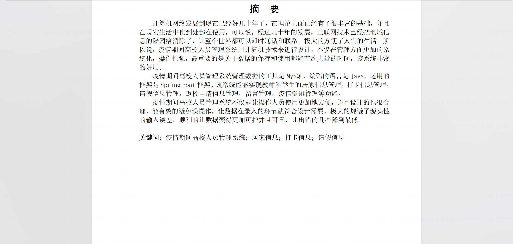
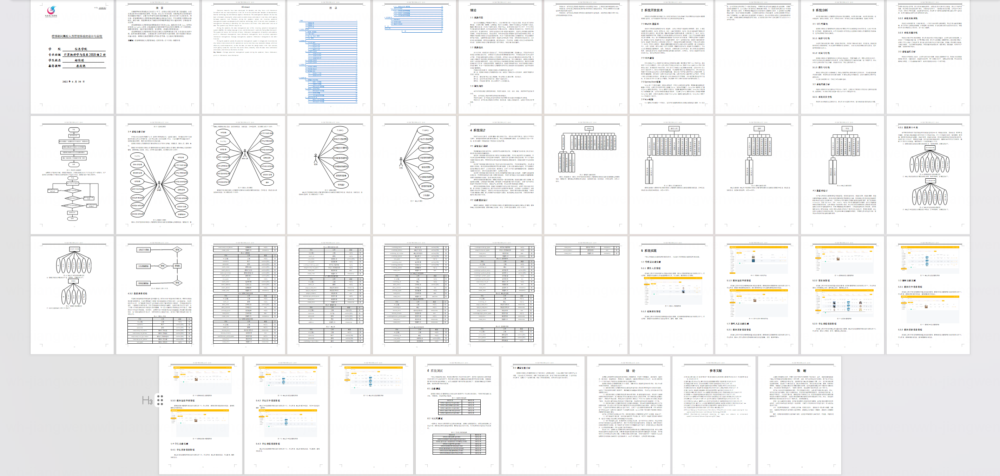

### 程序截图：
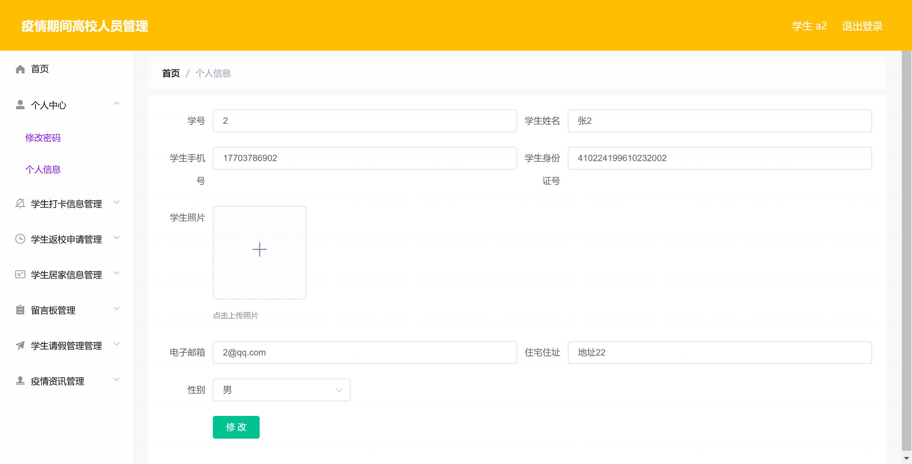
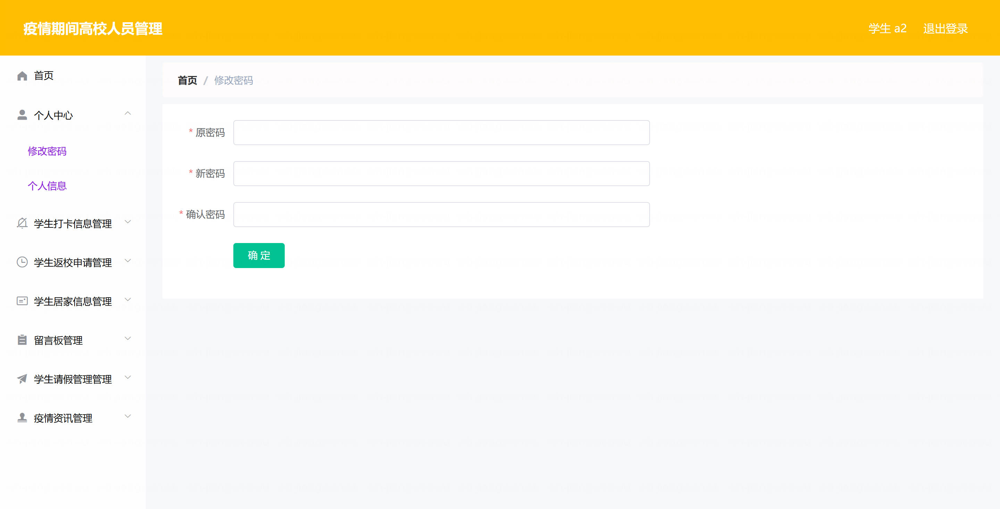
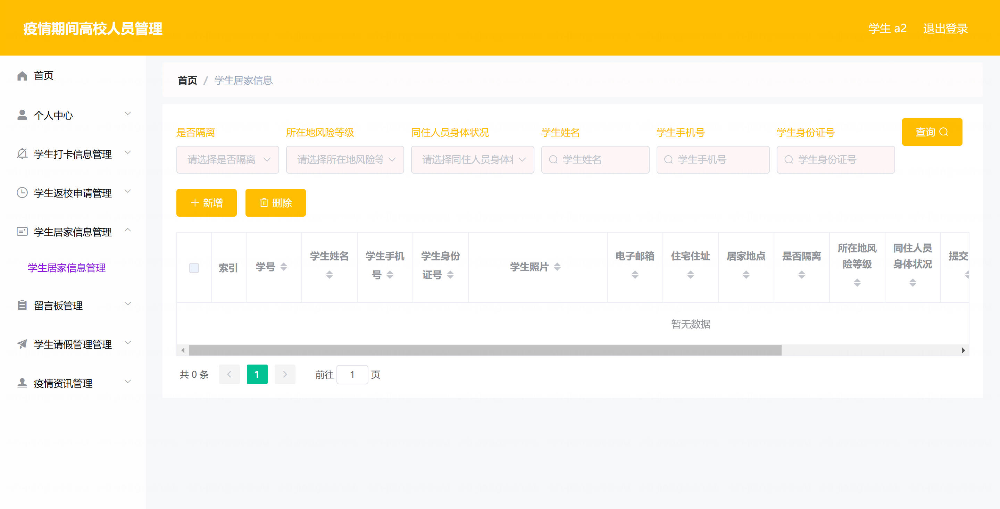
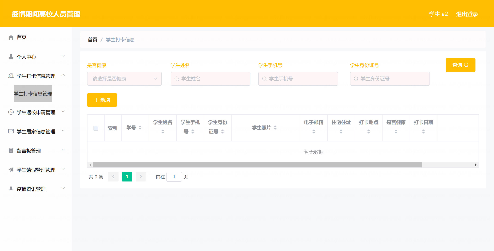
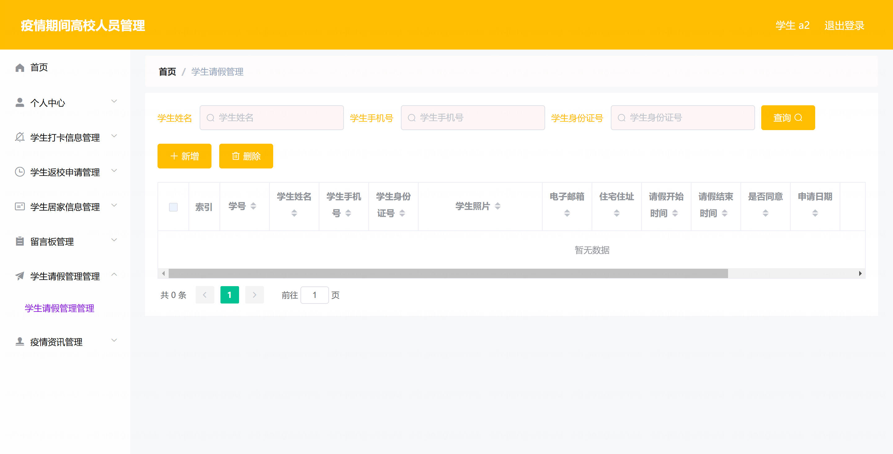
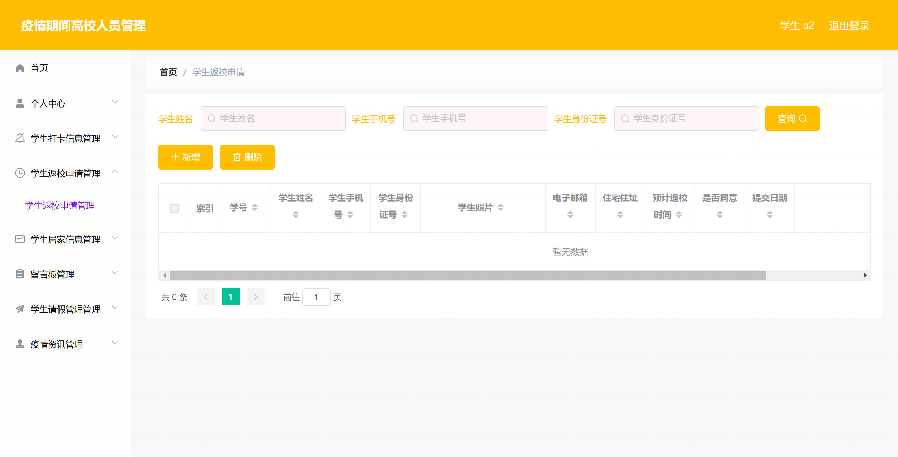
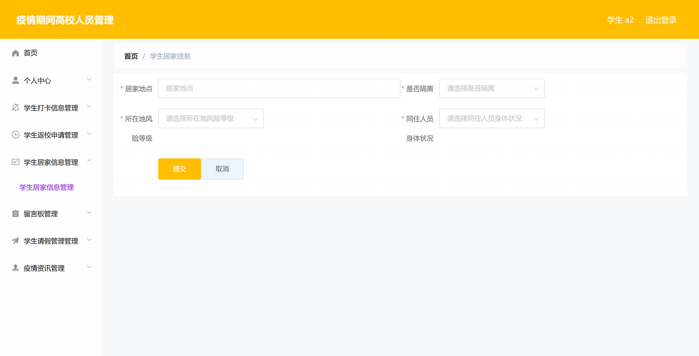
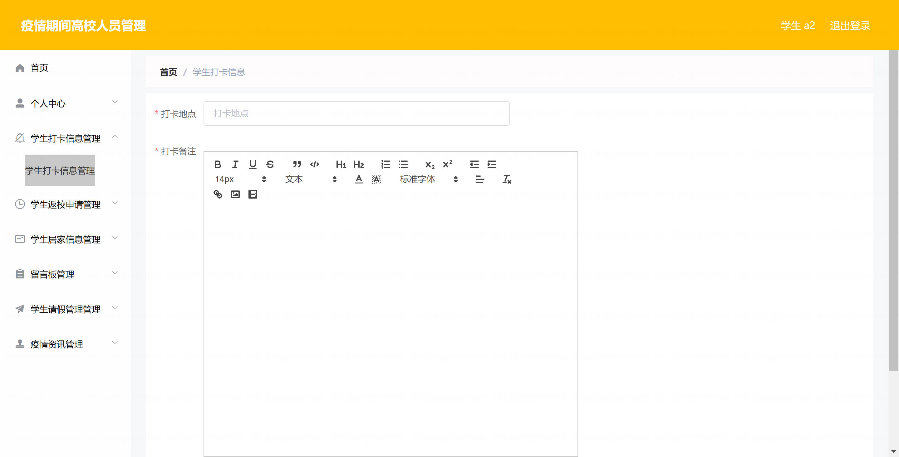
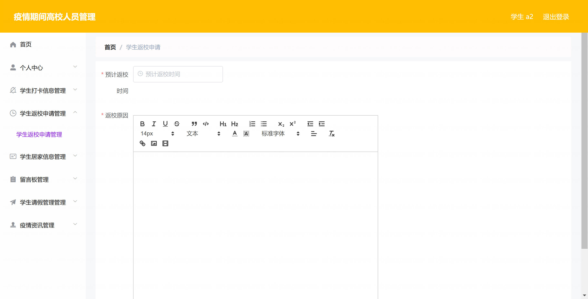
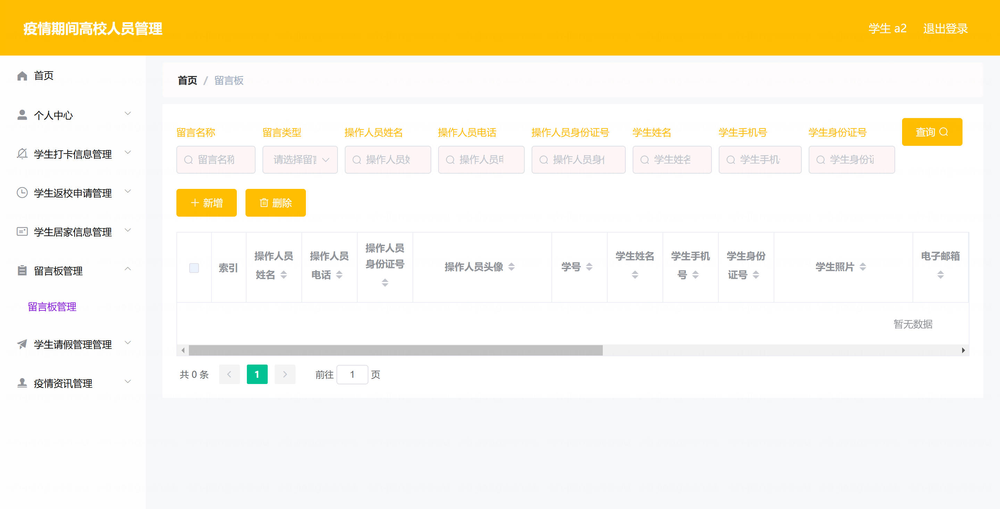
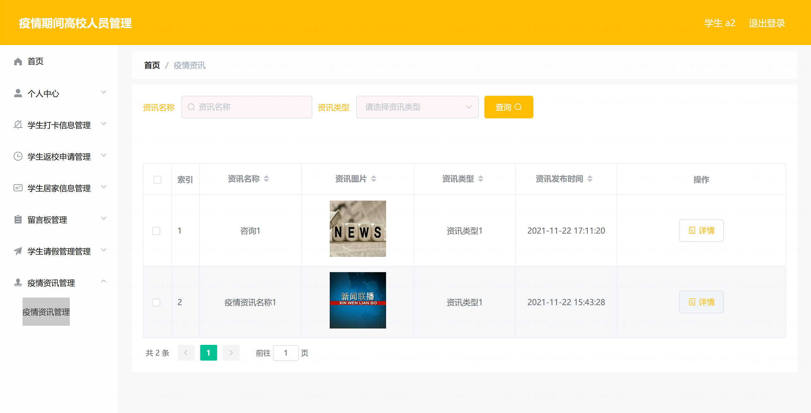
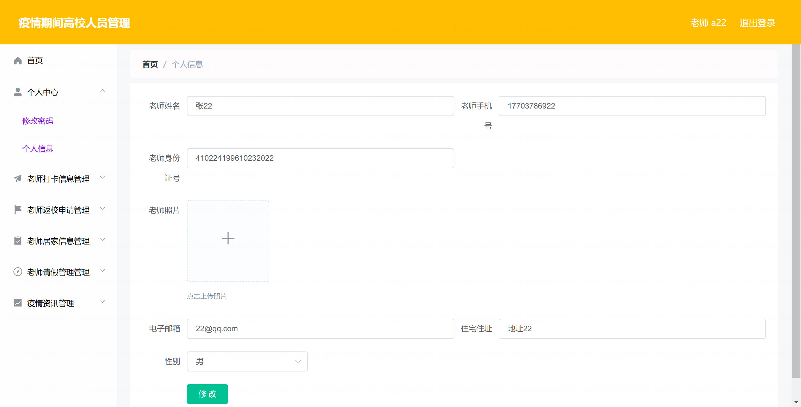

